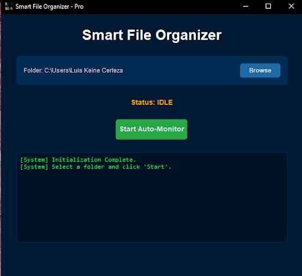
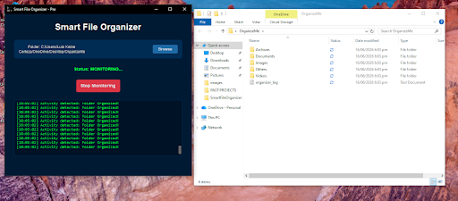
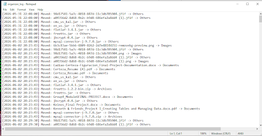

# Smart File Organizer (Python Automation)
**[ ARCHIVE_02 ]**

I built a real-time File Management System in Python to explore high-speed automation and system-level monitoring. My main goal was to transition my knowledge of structured Java development into the "Pythonic" world, focusing on background services and event-driven architecture. I chose Python for this project specifically to demonstrate my ability to build lightweight, high-performance utilities that improve workflow efficiency.

 
*Figure 1: The Professional GUI featuring CustomTkinter and a real-time activity log.*

### How it works:
* **The "Watchdog" Service:** The core of the app is an event-driven observer that "listens" to the file system. The moment a new file is dropped into the target folder, the system triggers the organization logic.
* **Auto-Categorization:** The app scans file extensions and instantly moves them into dedicated subfolders (e.g., `.pdf` to "Documents", `.jpg` to "Images").
* **Universal Folder Selection:** Unlike a basic script, this version includes a "Browse" feature, allowing it to work on any directory on any computer.
* **Live Activity Log:** A terminal-style text box provides real-time feedback on every file move using a high-contrast "Matrix Green" font.
* **Persistent Memory:** The app remembers the last folder you worked on using a JSON configuration system, so you don't have to re-browse every time you open it.


*Figure 2: The "After" state - Files automatically categorized into structured system folders.*

### Technical Implementation:
* **Backend:** Python 3.10+
* **UI Framework:** **CustomTkinter** (Professional "Deep Midnight Blue" Dark Mode)
* **Monitoring:** **Watchdog** library (Event-driven file system monitoring)
* **Logic Engine:** Rule-Based Classifier using **Dictionaries** for $O(1)$ lookup speed.
* **Concurrency:** Used the `threading` library to keep the UI responsive during background monitoring.
* **Packaging:** Used `auto-py-to-exe` to bundle the project into a standalone executable.

### Java vs. Python: Lessons Learned
As a student transitioning from an enterprise-level Java background, this project allowed me to translate complex concepts into Pythonic logic:
* **Data Structures:** I replaced complex Java `Switch` cases with Python **Dictionaries**. This provides a cleaner architecture and $O(1)$ efficiency for mapping file extensions.
* **Memory Management:** I swapped Java’s `try-with-resources` for Python’s `with` statements (**Context Managers**) to ensure that file handles and log streams are closed automatically.
* **Concurrency & UX:** I applied my knowledge of Java Threads to Python's `threading` library to separate the "Worker" logic from the "UI" thread, preventing system freezes.
* **Asset Management:** I engineered a `resource_path()` function to solve the "Internal Path" problem when compressing icons and assets into a single standalone EXE.


*Figure 3: System-level log file showing the movement history and timestamps.*

### Setup
1. Clone the repository to your local machine.
2. Install the required libraries:
   ```bash
   pip install customtkinter watchdog
